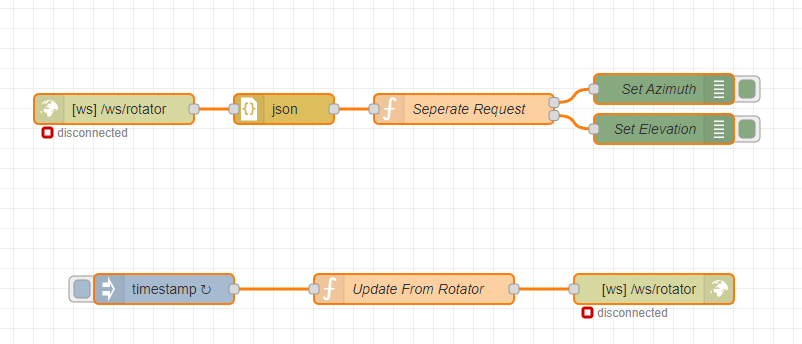

# Satellite Server

**Warning: This is still very much a work in progress**

Satellite Server provides a satellite tracking system that runs on a Raspberry PI. Setup a single satellite server to manage your TLE collections and make it available to other satellite applications. Also includes a tracking GUI with rotator control.

# Features

- Browser based Tracking and Rotator Control
- Download specific satellite TLE automatically from the [Satnogs DB](https://db.satnogs.org/) by only specifying a Norad ID (uses api)
- Load your own TLE parameters, helpfull for newly launched satellites
- Sort satellites of interest in various collections and make those collections available to other programs such as satpc32 and gpredict. 


# Basic Setup Instructions

Use [Raspberry PI Imager](https://www.raspberrypi.com/software/) to flash Raspberry PI OS Lite (tested with 2022-01-28 release)

You might want to enable ssh but putting an empty file on the sdcard called ssh (no extension)

Once the PI has booted you need to install the following dependencies:

```
sudo apt-get update
sudo apt-get install git
sudo apt-get install python3-pip
sudo apt-get install python3-numpy
```

Next up is cloning this repo and installing the python requirements

```
git clone https://github.com/tomvdb/satellite-server.git
cd satellite-server
pip install -r requirements.txt
```
Create initial database and configure you qth coordinates

```
python db_create.py
nano -w app/config.json
```

You can now start the test server. 

```
python satserver.py
```

# Getting Started

Navigate your browser to http://<your_pi_ip>:8080

To get started you need to add your first satellite. Browse to "Satellites" and click on "Add Satellite". You can now either enter all the details of the satellite into the form, or use the "Query Satnogs DB" section to enter a norad id. (For example the ISS is 25544.

Once you satellite is added you need to add it to a collection. Currently the "Default" Collection is what the main map uses.

Go back to the site home and your satellite will now show. You can select it to get more details and show the orbit and next pass.

# Updating TLE files

```
python update_tle.py
```

Its recommended to schedule that file via cron (no more than once a day)

# Security

This has not been designed to be exposed to the internet. Don't do it!

# Rotator Control

Rotator and Radio control is done via [Node-Red](https://nodered.org/) which is installed on the same Raspberry PI. The tracking application will attempt to connect to a websocket on [ws://localhost:1880/ws/rotator](ws://localhost:1880/ws/rotator). Any azimuth/elevation data received via the websocket will be displayed and any azimuth/elevation data sent will be passed to node-red via the websocket. This allows you to make a node that can control your rotator (or do various other things with the data).

A simple starter node-red flow template is located in the nodered_flow_examples. This flow contains the websocket components and a few basic functions. You can expand this flow to control your rotator and receive data from your rotator.



Send me your node-red flow examples for your rotator control and I will add it into the repo.

# Radio Control

Still working on this bit, but will be similar to rotator control. More information coming on this soon.

# Known Issues

Lots, its a work in progress. Use the Issues section to report your issues.

# Support

Please help test and report feature requests and bugs under the [Issues section](https://github.com/tomvdb/satellite-server/issues)

You can support this project by [Buying me a Coffee!](https://www.buymeacoffee.com/zr6tg)

# Credit
Inital Polar Chart Code is from the [Satnogs System](https://satnogs.org/)

Inspiration and Concepts from [gpredict](http://gpredict.oz9aec.net/)

<a href="https://www.flaticon.com/free-icons/satellite" title="satellite icons">Satellite icons created by Freepik - Flaticon</a>
